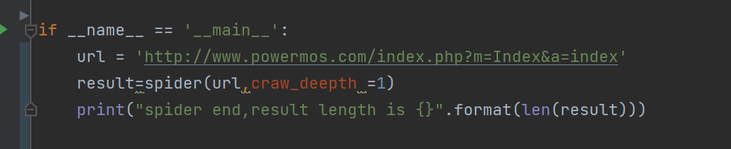

# spider脚本

> 一个爬取页面URL的脚本


在原来项目的基础上进行了魔改，我的需求是传入一个URL之后爬取页面中与它相关的URL

为什么不直接使用[crawlergo](https://github.com/Qianlitp/crawlergo)这类项目？虽然crawlergo的爬取已经足够使用了，但需要`-c`指定浏览器。如果我们想要将其合并到自己的项目里面，就很难做到跨平台。

在`github`上面另外的一些项目感觉都不太符合自己的要求，要么就是需要的库文件太多了，所以进行了魔改

魔改主要所作的工作如下：
+ 首先将适用于`python2`的项目升级为`python3`
+ 修改了例如`url_protocol`函数中的错误，`else`逻辑中返回错误协议
    ```python 
    def url_protocol(url):
        domain = re.findall(r'.*(?=://)', url)
        if domain:
            return domain[0]
        else:
            return url
    ```
+ 加强了静态文件后缀的过滤正则
+ 去除了一些畸形URL
+ 将命令行输入修改为函数调用
+ ...


# Usage

使用比较简单：

安装requests依赖

```
pip install requests
```

运行爬虫，调用`spider`函数即可，传入url和爬取深度，默认为`1`，返回`result`为结果列表，更方便将其内嵌到自己的项目里



